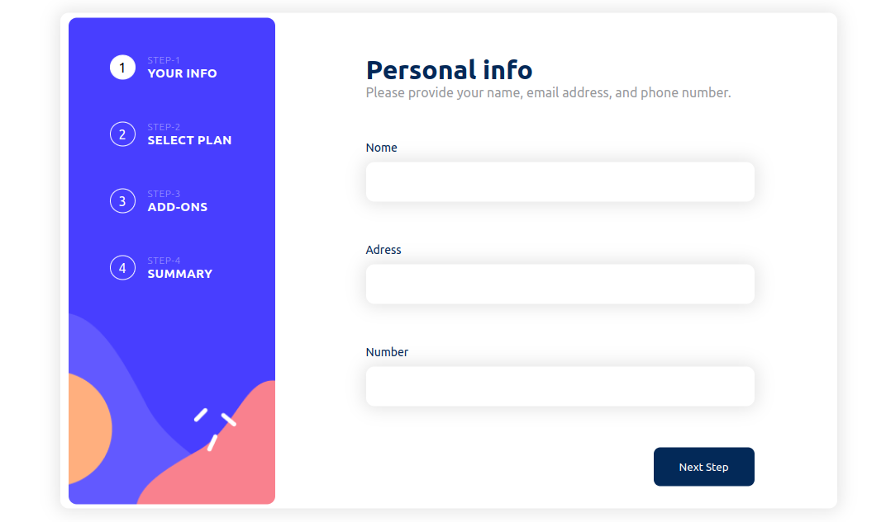
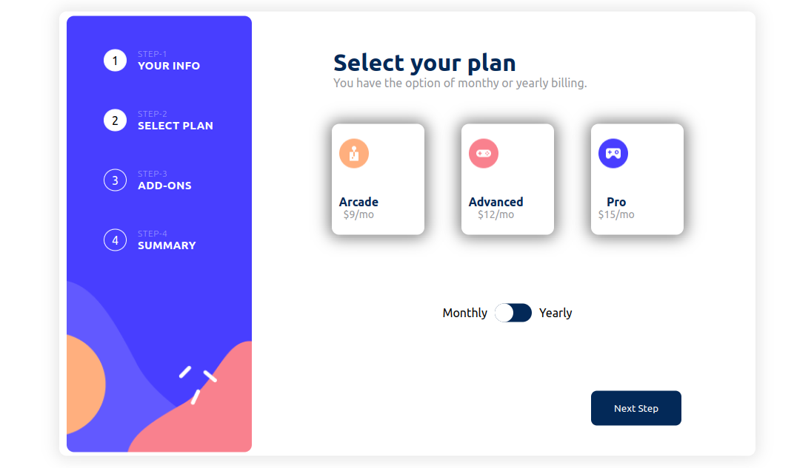
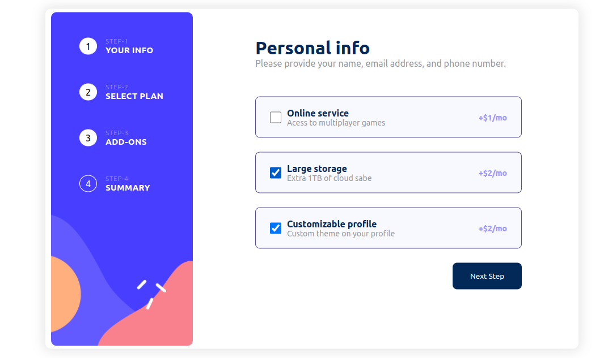
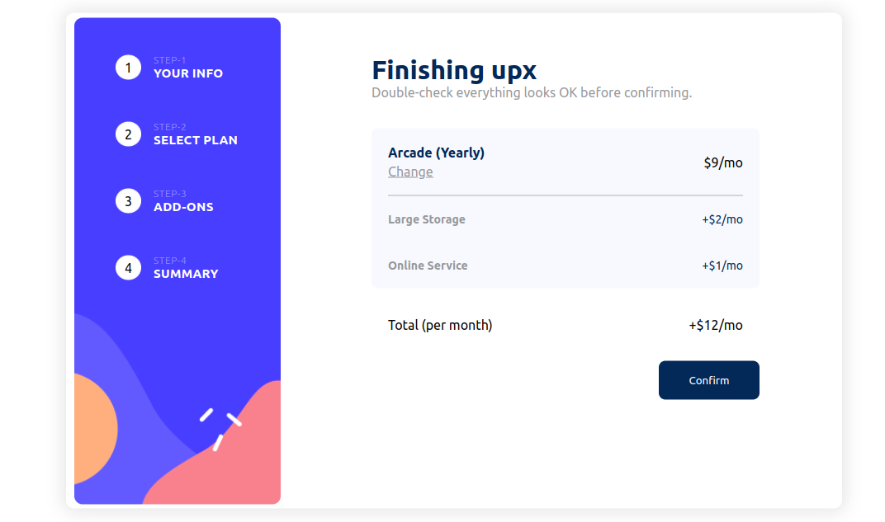
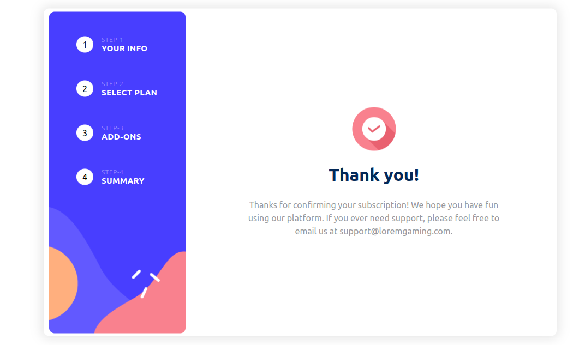
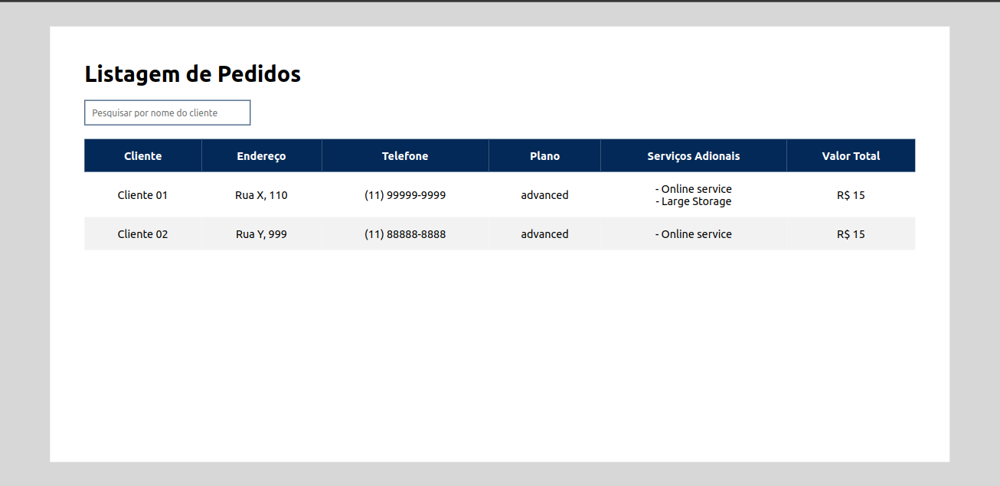

# Projeto CRUD em Java com Spring Boot (Backend) e React (Frontend)

## Descrição

O Multisteps Project é uma aplicação que gerencia pedidos de clientes em diferentes etapas. Ele oferece uma plataforma para registrar informações detalhadas do cliente, como nome, endereço e número de telefone, juntamente com serviços contratados e um plano associado.

Os principais recursos incluem a capacidade de criar novos pedidos, cada um com um plano específico e uma lista de serviços selecionados. O projeto visa simplificar o processo de rastreamento de pedidos e calcular automaticamente o custo total com base nos serviços escolhidos e no plano associado.

Além disso, o Multisteps Project utiliza tecnologias modernas, como Java, Spring Boot e Hibernate, para garantir uma implementação eficiente e escalável. Este projeto serve como uma base flexível para o desenvolvimento de sistemas de gerenciamento de pedidos personalizados.

## Como Executar o Backend 
1. Clone este repositório: `git clone https://github.com/yurineves1994/multi-steps.git`
2. Navegue até o diretório do projeto: `cd multisteps-project`
2. Acesse a paste Backend: `cd backend`
3. Execute o aplicativo: `./mvnw spring-boot:run`

## Configuração do Banco de Dados (MySQL) com Docker
1. **Instale o Docker: https://docs.docker.com/get-docker/**
2. **Crie e Inicie um Contêiner MySQL:**
    ```bash
    docker run -d -p 3000:3306 -e MYSQL_ALLOW_EMPTY_PASSWORD=yes -v ./algumapasta/dadosmysql:/var/lib/mysql mysql:5.7
escolha uma pasta no seu computador para guardar as informações do banco de dados localmente.

## Configuração do Frontend (React)
1. **Navegue até o diretório do frontend:**
   ```bash
   cd multisteps-project/frontend
   
2. **Instale as dependências:**
    ```bash
    npm install
    
3. **Inicie o aplicativo React:**
    ```bash
    npm dev
    
O aplicativo estará disponível em http://localhost:5173.

## **Etapas Front-end📋**
1 - Tela Inicial


2 - Tela de escolha de plano


3 - Tela para personalizar adicionais ao plano


4 - Tela de Resumo


5 - Tela de Finalização


5 - Painel Administrador


## Tecnologias Utilizadas

### Backend (Java/Spring Boot)
- [Java](https://www.java.com/)
- [Spring Boot](https://spring.io/projects/spring-boot)
- [Hibernate](https://hibernate.org/)

### Configuração do Ambiente
Certifique-se de ter o Java e [Maven](https://maven.apache.org/) instalados em seu sistema.

### Banco de Dados (MySQL) com Docker
- [Docker](https://www.docker.com/) - Plataforma para desenvolvimento, envio e execução de aplicativos em contêineres.
- [MySQL Docker Image](https://hub.docker.com/_/mysql) - Imagem oficial do MySQL para uso com Docker.

### Frontend (React)
- [React.js](https://reactjs.org/) - Biblioteca JavaScript para construção de interfaces de usuário.
- [React Router Dom](https://reactrouter.com/web/guides/quick-start) - Roteamento para aplicativos React.
- [Axios](https://axios-http.com/) - Cliente HTTP para fazer requisições HTTP.

## Contribuição
Contribuições são bem-vindas! Sinta-se à vontade para abrir problemas ou enviar pull requests.

## Contato
Caso tenham duvida ou identifiquem algum erro, meu LinkedIn (https://www.linkedin.com/in/yuri-travassos/)